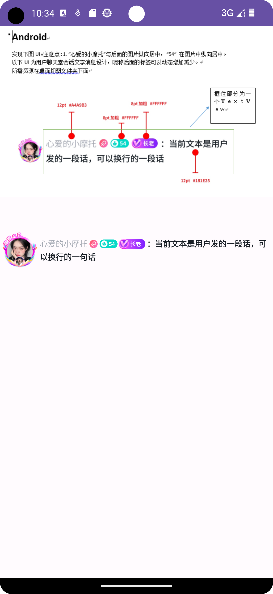

## Android Code 代码描述

1. 项目配置环境描述

   1. Android Studio Flamingo | 2022.2.1 Patch 2 版本
   2. Git
   3. Gradle 版本 gradle 8.0
   4. Java 默认创建使用 17
   5. Gradle Java 会实际根据项目版本来定

2. 对于弹幕类该需求

   1. 第一：圆形头像加载、圆形头像顶部显示的头像徽章；如果是网络图片下发，则需要考虑加载动图与加载失败的情况；
   2. 昵称之后的尾灯 UI，需要考虑多个尾灯的效果，比如性别、星座、等级、VIP、长老等，需要控制尾灯实现的个数、多行显示，换行处理；
      - 对于不同尾灯展示的前后顺序可以使用权重来过滤，通过基类尾灯类进行分发，然后在子类尾灯类中区分
      - 对于不同尾灯展示与否，可以通过下发尾灯遍历然后过滤 filter 不显示的尾灯内容 ，根据权重排序 sort
   3. 在弹幕实时的情况下，尾灯或者聊天内容包含网络动图的情况下需要额外处理。

3. 预览：
   
   
   
   
